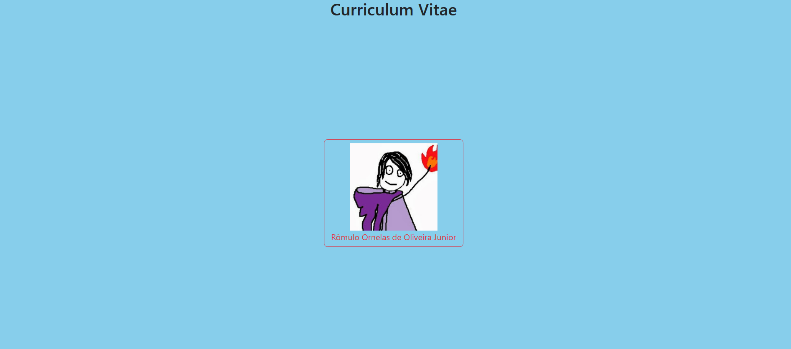
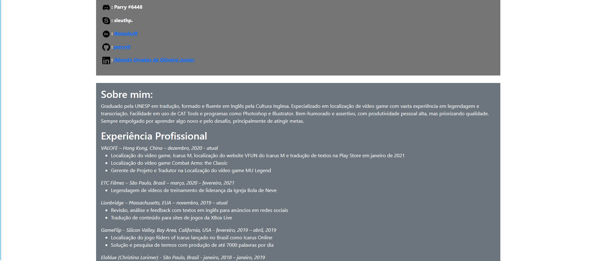

# CVBootstrapRomulo
curriculo feito com bootstrap para começar a aprender a usar ele

  <h3>Menu meio feinho. Primeira vez testando bootstrap</h3>
  

  

  <h3>Página simples com bootstrap</h3>
  

  
  <h3>me contratem!!!!</h3>
